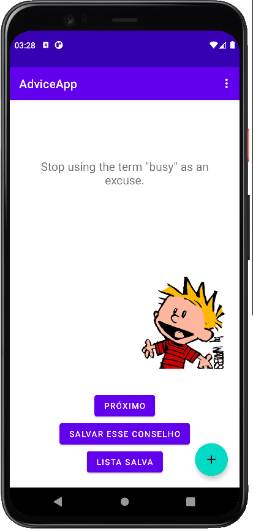

<h1 align="center">AdviceMeApp</h1>

<p align="center">
  <a href="https://opensource.org/licenses/Apache-2.0"></a>
  <a href="https://android-arsenal.com/api?level=21"></a>
  <br>
  <a href="https://wa.me/+5513997254841"></a>
  <a href="https://www.linkedin.com/in/christyan-segecs-359894115/"></a>
  <a href="mailto:christyansegecs@hotmail.com"></a>
</p>

<p align="center">  

⭐ Esse é um projeto para demonstrar meu conhecimento técnico no desenvolvimento Android nativo com Kotlin. Mais informações técnicas abaixo.

Aplicativo que faz requisições para uma API de conselhos, retornando à cada requisição um conselho aleatório diferente e permite salvar os conselhos desejados em um banco de dados remoto, que o usuário pode acessar na tela de conselhos salvos por ordem cronológica. Nesse banco de dados remoto (Firebase) são armazenados alguns dados do usuário e todos os conselhos salvos por esse usuário. Para isso também criei uma tela de autenticação e login.

</p>

</br>

<p float="left" align="center">

 
 
 
 
</p>

## Download

Faça o download do Aplicativo clicando aqui >> <a href="apk/AdviceMeApp.apk?raw=true">AdviceMeApp APK</a>
</br>
Você pode ver <a href="https://www.google.com/search?q=como+instalar+um+apk+no+android">aqui</a> como instalar uma APK no seu aparelho android.

## Tecnologias usadas e bibliotecas de código aberto

- Minimum SDK level 21
- [Kotlin (Linguagem de Programação utilizada)](https://kotlinlang.org/)

- Jetpack
  - Lifecycle: Observe os ciclos de vida do Android e manipule os estados da interface do usuário após as alterações do ciclo de vida.
  - ViewModel: Gerencia o detentor de dados relacionados à interface do usuário e o ciclo de vida. Permite que os dados sobrevivam a alterações de configuração, como rotações de tela.
  - ViewBinding: Liga os componentes do XML no Kotlin através de uma classe que garante segurança de tipo e outras vantagens.
  - Room: Biblioteca de abstração do banco de dados SQLite que garante segurança em tempo de compilação e facilidade de uso.

- Arquitetura
  - MVVM (Model - View - ViewModel)
  - Comunicação da ViewModel com a View através de LiveData
  - Comunicação da ViewModel com a Model através de Kotlin Flow
  - Repositories para abstração da comunidação com a camada de dados. Obs.: Eu substitui o uso do banco de dados local por um banco de dados remoto (Firebase)
  
- Bibliotecas
  - [Retrofit2 & OkHttp3](https://github.com/square/retrofit): Para realizar requisições seguindo o padrão HTTP.
  - [Picasso](https://github.com/square/picasso): Para carregamento de imagens e cacheamento das mesmas.
  - [Room](https://developer.android.com/topic/libraries/architecture/room?hl=pt-br): Para criação e gerenciamento do banco de dados local. Obs.: Eu substitui o uso do banco de dados local por um banco de dados remoto (Firebase)
  - [Firebase](https://developer.android.com/topic/libraries/architecture/room?hl=pt-br): Para criação e gerenciamento do banco de dados remoto.

## Arquitetura
**AdviceMeApp** utiliza a arquitetura MVVM e o padrão de Repositories, que segue as [recomendações oficiais do Google](https://developer.android.com/topic/architecture).
<br>

## API de terceiros

Advice Slip JSON API - https://api.adviceslip.com/
Uma API que retorna um conselho aleatório diferente a cada requisição.

# Licença

```xml

          Copyright [2023] [Christyan Segecs Silva]

   Licensed under the Apache License, Version 2.0 (the "License");
   you may not use this file except in compliance with the License.
   You may obtain a copy of the License at

     http://www.apache.org/licenses/LICENSE-2.0

   Unless required by applicable law or agreed to in writing, software
   distributed under the License is distributed on an "AS IS" BASIS,
   WITHOUT WARRANTIES OR CONDITIONS OF ANY KIND, either express or implied.
   See the License for the specific language governing permissions and
   limitations under the License.

```
